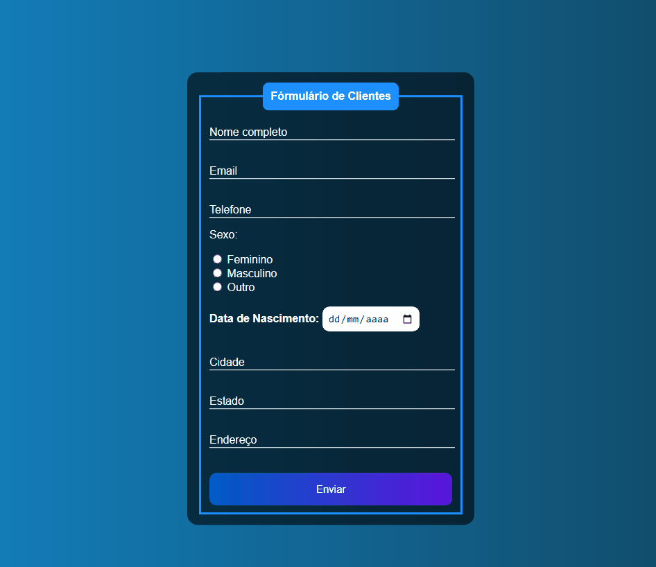

# Formulário
 Formulário com HTML & CSS.

 

***
## Agradecimentos :clap:

* Primeiramente a Deus.
* Se você achar que esse projeto agregou algo para você, por favor deixe uma estrela.
* Meus sinceros agradecimentos a todos que visitam o projeto e deixa uma estrela como reconhecimento.
* Foi muito gratificante desenvolver esse Formulario em HTML e CSS.

***